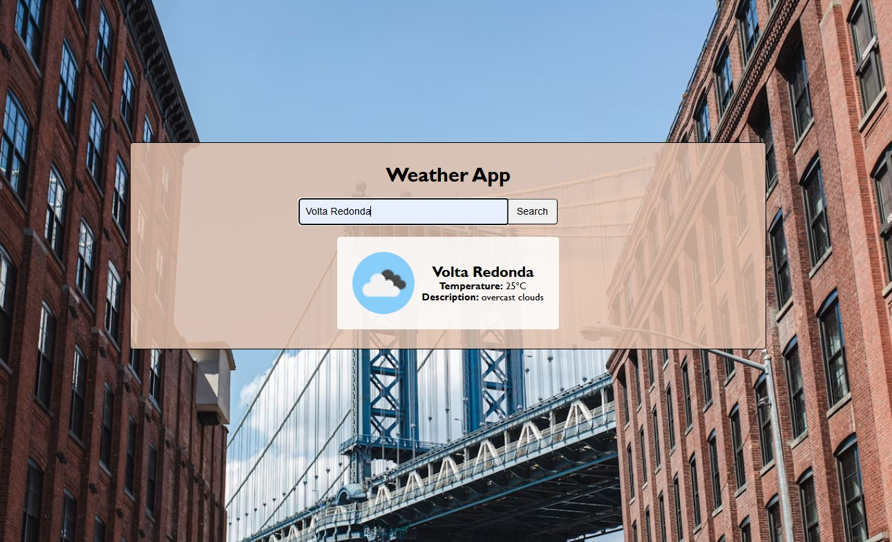

# 🌤️ Weather App

A simple and responsive weather app that fetches real-time weather data by city name using the OpenWeather API. (Codédex Project)

## 🖥️ Preview

## 🚀 Features

- Search weather by city name
- Displays current temperature (°C) and weather description
- Weather icon from OpenWeather
- Input validation with user-friendly error messages
- Responsive and clean UI

## 🛠️ Technologies Used

- HTML5
- CSS3
- JavaScript
- [OpenWeather API](https://openweathermap.org/api)

## ⚠️ Important

Never commit your API key to a public repository. Keep it local or use environment variables if deploying to a server.
